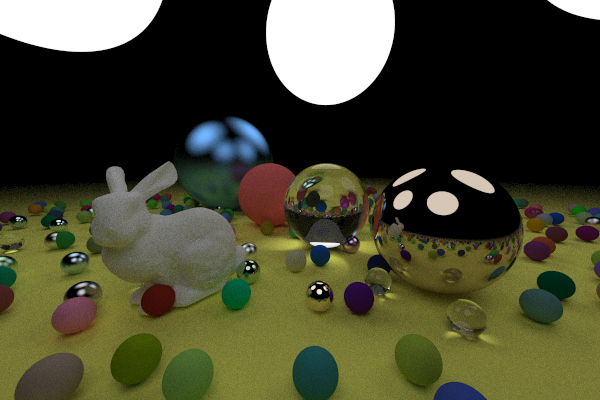
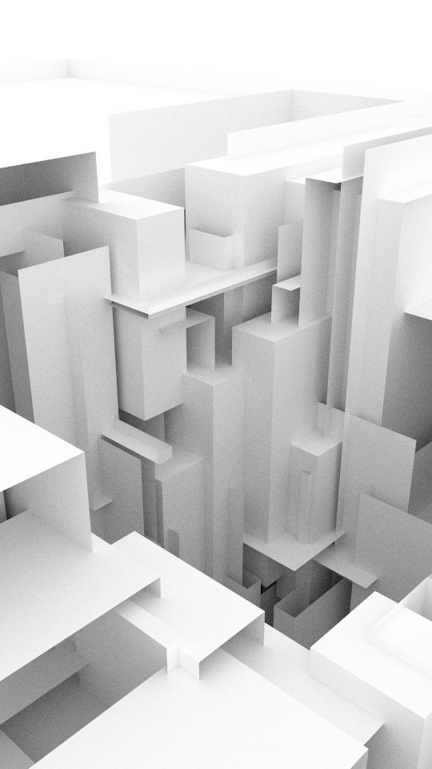
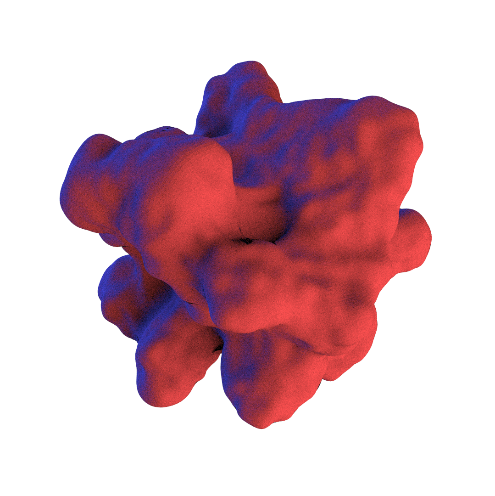
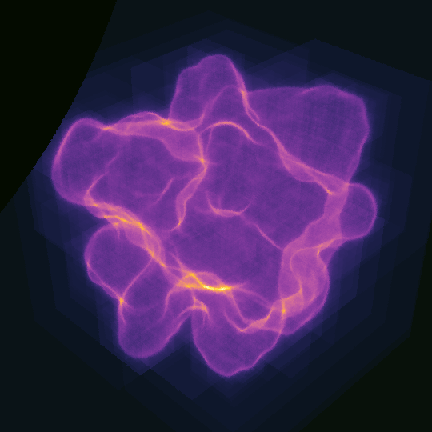
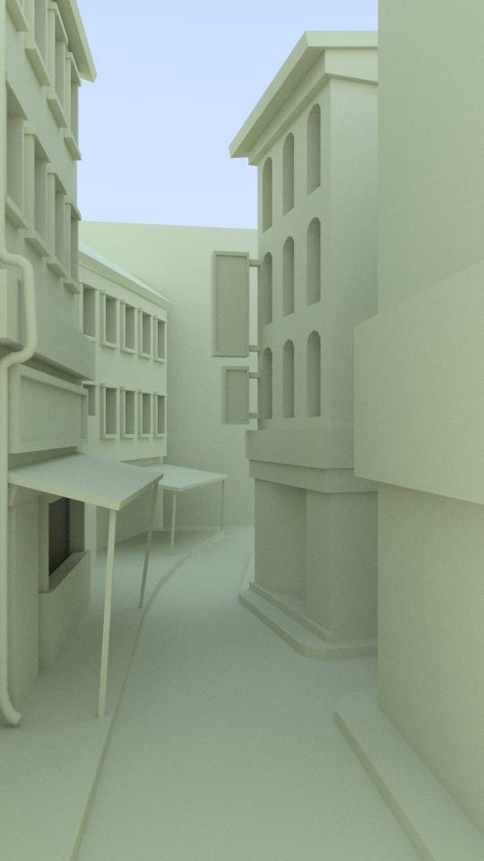
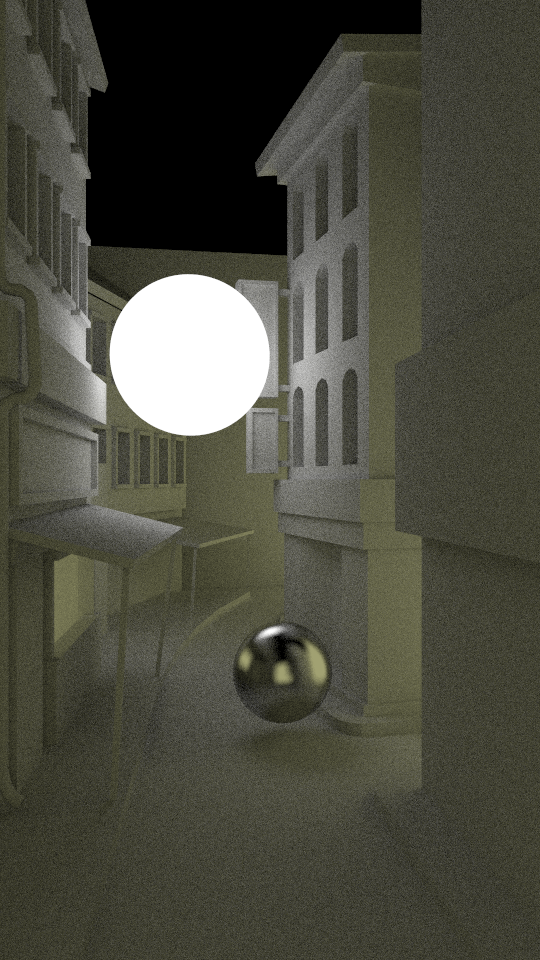
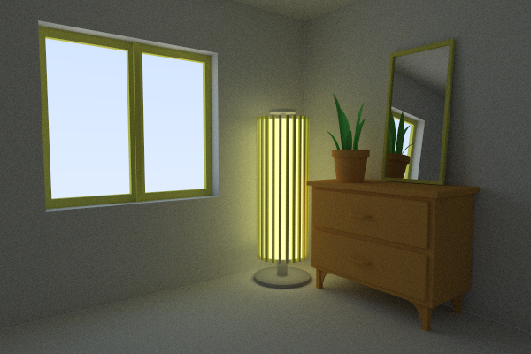

# raytracing

A simple path tracer supporting different materials e.g. diffuse lambertian, metal, glass, diffuse light etc. The acceleration structure used is a bounding volume hierarchy (BVH) that uses the surface area heuristic (SAH) to divide it's volumes. The path tracer is using the architecture from the famous [Ray Tracing in One Weekend](https://raytracing.github.io/) tutorial. Other resources that were very helpfull were:

- [Unity Toy Path Tracer](http://theinstructionlimit.com/unity-toy-path-tracer) (Path tracer by Renaud Bédard, the programmer of the game FEZ!)
- [SORT](https://github.com/JiayinCao/SORT) (Simple Open-source Ray Tracer)
- [Global Illumination in 99 lines of C++](http://www.kevinbeason.com/smallpt/) (Seeing that a path tracer can be written in 99 lines made me less intimidated by the subject)
- [Global Illumination and Path Tracing](https://www.scratchapixel.com/lessons/3d-basic-rendering/global-illumination-path-tracing) (Scratch a Pixel is great for starting in graphics)
- [Inigo Quilez](https://www.iquilezles.org/index.html) (many great practical techniques for raytracing, raymarching etc.)
- [Physically Based Rendering: From Theory to Implementation](http://www.pbr-book.org/3ed-2018/contents.html) (The pathtracing "bible")

Here are some rendered images:

